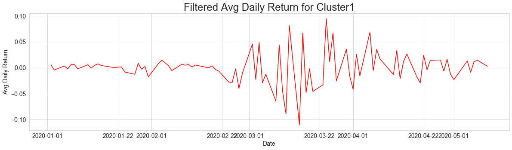
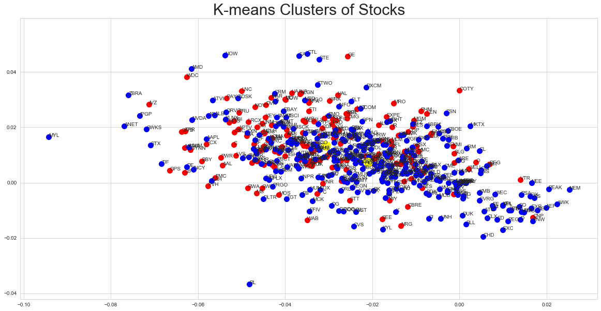

# Stocks Clustering
Machine Learning Assignment 2 

Managed to find average daily return clusters of the sp500 stocks and analyzing the effect of Covid-19
on companies. Using various models and methods: Kmeans, Agglomerative Clustering and GMM.

## Analysis Highlights:

Data acquired from http://www.slickcharts.com/sp500/

The period of disturbance is exactly when covid-19 erupted at large (February 2020).

Clustering stocks with Kmeans - the centers are too close.

Clustering stocks with GMM - much better separation.
